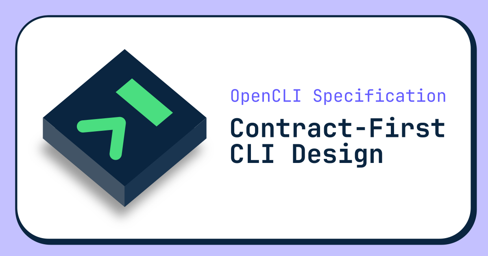
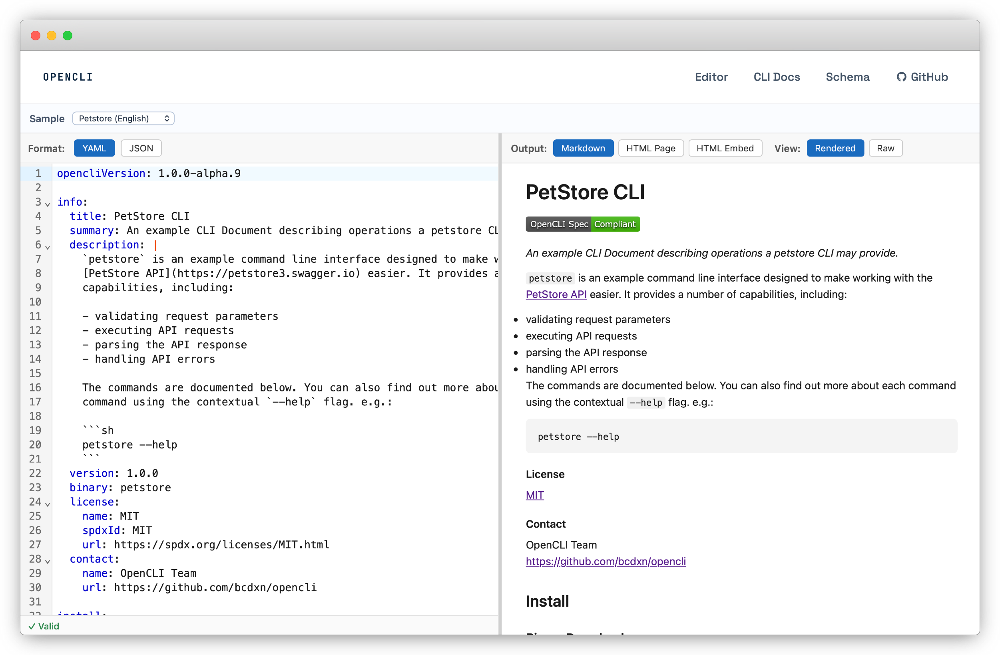

[](https://opencli.dev)

# OpenCLI Specification

Define your Command Line Interface (CLI) in a declarative, language-agnostic document that can be used to generate documentation and boilerplate code.

_Like OpenAPI Spec, but for your CLIs_

---

[](https://pkg.go.dev/github.com/bcdxn/opencli)
[](https://www.bestpractices.dev/projects/13457)
[](https://opencli.dev)
[](https://github.com/bcdxn/opencli/actions/workflows/ci.yaml)
[](https://github.com/bcdxn/opencli/stargazers)

## Table of Contents

- [Overview](#overview)
- [Benefits](#benefits)
- [OpenCLI CLI](#opencli-cli)
- [Live Editor](#live-editor)
- [Examples](#examples)
- [The Spec](#the-spec)
- [Releases](#releases)
- [Inspiration](#inspiration)

## Overview

OpenCLI specification is a document specification that can be used to describe CLIs. Spec-compliant documents are meant to be human-readable and enable tooling automation.

## Benefits

- Promote contract first development
- Decouple implementation of commands from the CLI Framework
- Automatically generate documentation your CLI
- Automatically generate CLI framework-specific code
- Improve LLM and agent understanding of your CLI

## OpenCLI CLI

Use the CLI to validate specs, generate docs and generate boilerplate code.

- [Markdown Docs](https://github.com/bcdxn/opencli/blob/main/docs/opencli.ocs.md)
- [OpenCLI Spec-compliant Document](https://github.com/bcdxn/opencli/blob/main/opencli.ocs.yaml)

## Live Editor

Try the live [OpenCLI Specification Editor](https://opencli.dev)

[](https://opencli.dev/editor)

## Examples

### Pleasantries CLI

Let's describe the following CLI

```sh
$ pleasantries greet John --language=english
# hello John
$ pleasantries farewell Jane --language=spanish
# adios Jane
```

The CLI above can be described using an OpenCLI Specification Document in YAML (or JSON):

```yaml
# cli.yaml

opencliVersion: 1.0.0-alpha.9

info:
  title: Pleasantries
  summary: A fun CLI to greet or bid farewell
  version: 1.0.0
  binary: pleasantries

commands:
  pleasantries {command} <arguments> [flags]:
    group: true

  pleasantries greet <name> [flags]:
    summary: "Say hello"
    args:
      - name: "name"
        summary: "A name to include the greeting"
        required: true
        type: "string"
    flags:
      - name: "language"
        summary: "The language of the greeting"
        type: "string"
        choices:
          - value: "english"
          - value: "spanish"
        default: "english"

  pleasantries farewell <name> [flags]:
    summary: "Say goodbye"
    args:
      - name: "name"
        summary: "A name to include in the farewell"
        required: true
        type: "string"
    flags:
      - name: "language"
        summary: "The language of the greeting"
        type: "string"
        choices:
          - value: "english"
          - value: "spanish"
        default: "english"
```

From this example we can generate documentation using the follow command:

```sh
ocli gen docs \
  --format markdown \
  --out ./docs \
  ./cli.osc.yaml
```

To generate embeddable HTML docs as a script bundle:

```sh
ocli gen docs \
  --format html-embed \
  --out ./docs \
  ./cli.ocs.yaml
```

This writes ./docs/ocli-docs.js. You can then mount it in any page:

```html
<html>
  <head>
    <script src="./assets/ocli-docs.js"></script>
  </head>
  <body>
    <div id="docs"></div>
    <script>
      window.OcliDocs({ containerId: "docs" });
    </script>
  </body>
</html>
```

We can also use the specification to generate boilerplate code for common CLI libraries:

```sh
ocli gen cli \
  --framework cobra \
  --out ./internal \
  ./cli.ocs.yaml
```

## Packages

Don't want to use the CLI, and instead prefer library integration? You can use the the following packages:

### `codec`

Use this package to marshal and unmarshal OpenCLI Spec compliant documents

```sh
go get github.com/bcdxn/opencli/codec
```

### `validate`

Use this package to validate OpenCLI Spec compliant documents

```sh
go get github.com/bcdxn/opencli/validate
```

## The Spec

The full spec is described by JSON Schema - https://github.com/bcdxn/opencli/tree/main/spec.schema.json

Not all rules can be adequately expressed in JSON Schema alone. Additional validation logical is implemented in the `validate` package.

## Releases

Start using OpenCLI Specification Documents to describe your CLIs. Head over to the [releases page](https://github.com/bcdxn/opencli/releases) to download the CLI for your system.

## Inspiration

- [OpenAPI Specification](https://swagger.io/specification/)
- Code generation tools like:
  - [oapi-codegen](https://github.com/oapi-codegen/oapi-codegen)
  - [ogen](https://ogen.dev)
- Stripe's [amazing looking CLI documentation](https://docs.stripe.com/cli)
- All of the incredible CLI Frameworks
  - [Cobra](https://cobra.dev)
  - [Urfave CLI](https://cli.urfave.org)
  - [Yargs](https://yargs.js.org)
  - [Commander.JS](https://github.com/tj/commander.js/)
